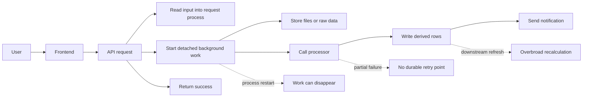
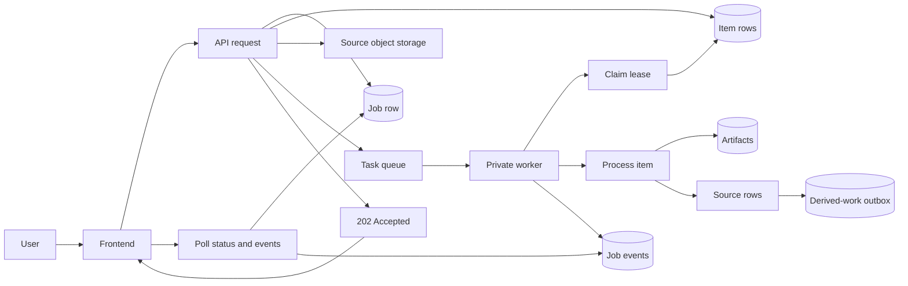
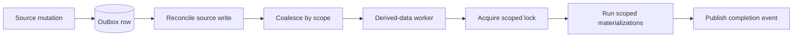

# Stop Hiding Critical Work in Request Threads

Fast API responses are good. Fast API responses that quietly push critical work into a fragile background thread are not.

This is a common trap in product engineering. A user uploads something, imports something, kicks off a sync, or triggers a recalculation. The request handler does enough work to say "accepted", then starts some detached process in memory and returns. From the user's point of view, the app feels responsive. From the system's point of view, the important work is now running without a durable contract.

That is fine until it is not.

The process restarts. One file fails halfway through a batch. A retry duplicates rows. A downstream table refreshes broadly because nobody recorded the exact scope of the change. Support cannot tell whether the job is queued, running, stuck, partly complete, or already failed. The only reliable artifact is a user saying, "I uploaded this and nothing happened."

The fix is not "make the request timeout longer." The fix is to stop treating critical background work as a side effect of a web request.

## The Smell

The unreliable version usually starts innocently:

Nothing in that diagram is unusual. That is exactly why it is dangerous.

The API process has become both the control plane and the worker. It validates requests, owns uploads, calls processors, waits for external services, writes source data, kicks off derived data refreshes, and reports completion. If the work is slow, expensive, multi-step, or important to user trust, this coupling eventually hurts.

The symptoms tend to be predictable:

- There is no durable job id to show the user.
- There is no per-item state for a batch.
- Retries either repeat too much work or cannot safely repeat any work.
- Cancellation is best-effort at most.
- Partial success is hard to represent.
- Workers cannot resume from a clear checkpoint.
- Downstream recalculation is triggered directly instead of recorded as intent.
- Support and operations need logs to answer basic product questions.

Once those symptoms show up, the right abstraction is a job system.

## The Better Contract

A durable job system makes the API a short-lived control plane. The request handler accepts work, records it, stores inputs, enqueues execution, and returns a pollable response. Workers do the slow work later under leases, with explicit state transitions.

The important change is not the queue. The queue is only transport.

The important change is the contract:

- The work has an identity.
- The work has persisted state.
- Each meaningful unit has its own lifecycle.
- Every retry has a safe checkpoint.
- Downstream work is recorded before it is executed.
- The UI can poll state instead of guessing.
- Operations can inspect facts instead of reconstructing intent from logs.

## Accept Work, Do Not Perform It

The API request should do the minimum amount of work needed to make the job real.

That usually means:

1. Authenticate and authorize the caller.
2. Validate request shape, limits, and idempotency key.
3. Create a job row.
4. Create item rows for each file, record, or subtask.
5. Store immutable source inputs.
6. Enqueue worker execution.
7. Return `202 Accepted` with `job_id`, current `status`, current `stage`, and a `status_url`.

The API can still fail fast for invalid requests. What it should not do is begin expensive work that only exists inside the lifetime of the request process.

This changes user experience in a useful way. The app no longer pretends work is complete because the upload endpoint returned. It tells the truth: accepted, queued, running, partially complete, failed, cancelled, or complete.

That honesty matters. Users can navigate away and come back. Support can ask for a job id. The product can show progress without inventing it.

## Model Job State Explicitly

A useful job table does not need to be clever. It needs to be boring and strict.

One compact way to sketch the model:

| Job fields | Item fields | Append-only events |
| --- | --- | --- |
| `id` | `job_id` | `job_created` |
| `type` | `item_id` | `item_started` |
| `status` | `status` | `item_succeeded` |
| `stage` | `source_uri` | `item_failed_retryable` |
| `progress_current` | `attempt_count` | `item_failed_terminal` |
| `progress_total` | `next_retry_at` | `job_partially_succeeded` |
| `idempotency_key` | `artifact_uri` | `job_succeeded` |
| `created_by` | `inserted_row_count` | `job_failed` |
| `lease_owner` | `error_code` | `job_cancel_requested` |
| `lease_expires_at` | `error_message` | `job_cancelled` |
| `attempt_count` | | |
| `cancel_requested_at` | | |
| `completed_at` | | |
| `failed_at` | | |
| `error_code` | | |
| `error_message` | | |

Status transitions should be validated, not implied. A succeeded job should not become running again. A cancelled item should not write output. A worker with an expired lease should not keep committing state.

The goal is to make invalid states difficult to represent.

## Lease Work, Then Checkpoint Often

Workers should claim work with a lease instead of assuming queue delivery means ownership.

Queue delivery answers one question: "Should someone try this?" A lease answers a different question: "Who is allowed to mutate this job right now?"

That distinction matters because real systems retry. Messages redeliver. Containers restart. Network calls time out after the remote side already did the work. Admins replay tasks. Scheduled repair jobs run later. Without ownership and checkpoints, all of those cases become duplicate-write bugs.

A practical worker loop looks like this:

1. Claim the job if it is queued, retryable, or running with an expired lease.
2. Claim the next retryable item.
3. Mark the item running.
4. Process from immutable source input.
5. Write artifacts and source rows idempotently.
6. Record item result.
7. Emit job event.
8. Update job progress.
9. Release or extend lease.

Checkpoint after each item. A batch of twenty files should not restart from zero because file nineteen failed. The job should know that eighteen items succeeded, one failed, and one has not started.

That is also what makes partial success possible. A user can get useful results for successful items while retrying only failed ones.

## Make Idempotency Concrete

Idempotency is not a comment. It is stored data plus rules.

At the request boundary, an idempotency key prevents duplicate job creation when a client retries an upload or submit action. The key should be scoped to the actor and operation, and it should reject mismatched payloads. If the same key arrives with different input checksums, that is not a retry. That is a conflict.

Inside workers, idempotency usually means writing with stable identifiers:

- Source files use stable object paths or stored object generations.
- Artifacts are tied to `job_id` and `item_id`.
- Source rows carry an import key, item key, or content checksum.
- Derived-work requests deduplicate by scope.
- Retry attempts update existing state instead of inserting unrelated state.

Idempotency should be designed at each boundary. Request retries, queue retries, worker retries, external-service retries, database retries, and admin replays all fail differently.

## Treat Downstream Recalculation as Work Too

One subtle mistake is making the initial job durable while leaving downstream recalculation as a direct side effect.

For example, after a worker stores source rows, it might directly call a materialization endpoint or kick off a broad refresh. That works in the happy path, but it recreates the original problem one layer deeper. The derived work has no independent lifecycle.

Use an outbox instead.

The outbox records intent: what changed, what derived data is affected, and from what point in time. A separate worker can then coalesce multiple requests, acquire a scoped lock, and run only the necessary materializations.

That gives you three benefits:

- Source writes and derived writes no longer need to pretend they are one transaction.
- Recalculation can be retried, inspected, and dead-lettered.
- Multiple nearby mutations can collapse into one scoped refresh.

This is especially important when derived data is expensive. Broad refreshes are easy to reason about but costly to run. Scoped refreshes are cheaper, but only safe when the system records enough intent to know the scope.

## Design for Cancellation and Repair

Cancellation is a state transition, not a signal you hope every function notices.

When a user cancels a job, store `cancel_requested_at`. Workers should check that field at safe points: before claiming another item, before calling an expensive external processor, and before publishing final output. Already-committed item results stay committed. Not-yet-started items can become cancelled.

Repair needs the same discipline. Admin retry should not mean "run the whole thing again and hope." It should mean:

- Retry failed items.
- Replay a job from stored source inputs.
- Requeue stale leased work.
- Mark unrecoverable work dead-lettered with a reason.
- Trigger derived recalculation for a known scope.

Those controls are only safe if the job model already tracks items, artifacts, attempts, leases, and terminal states.

## Keep Workers Private

Once work moves out of the API process, the worker boundary becomes part of the security model.

Do not expose worker endpoints as public product APIs. Treat them as internal execution surfaces:

- Require service-to-service authentication.
- Validate task payloads against persisted job state.
- Refuse to process jobs the caller does not own.
- Keep source inputs in controlled storage.
- Fail closed when required metadata is missing.

The public API should create and observe jobs. Private workers should execute them.

That separation also makes architecture drift easier to catch. Add tests or static checks that prevent request handlers from calling processors directly, starting detached task threads, or triggering derived materializations inline. If the job system exists but new code can bypass it, the old failure mode will return.

## What the User Sees

A durable job system should improve UX, not leak infrastructure.

Users do not need to know about leases, queues, outboxes, or worker retries. They need honest state:

- Queued
- Processing file 3 of 8
- Waiting for recalculation
- Completed
- Completed with 2 failed files
- Failed and retryable
- Cancelled

The frontend can poll job status and events. It can keep recent job ids in session storage so active jobs remain visible after a modal closes or the user navigates away. It can invalidate affected views only when the relevant derived work finishes, instead of guessing based on the initial submit response.

That last point is easy to miss. If the UI refreshes too early, users see stale data and lose trust. If it refreshes too broadly, the app wastes work. Stage-aware invalidation lets the interface update when the system has actually reached the stage that matters.

## Costs

This pattern adds moving parts:

- More tables.
- More statuses.
- More tests.
- More operational surfaces.
- More deployment configuration.
- More ways for code to be "almost right" but not quite safe.

That is real cost. Not every background task deserves this treatment.

Use the durable pattern when work is:

- User-visible.
- Slow enough to outlive a comfortable request.
- Expensive to repeat.
- Multi-item or partially successful.
- Dependent on external processors.
- Required to update derived data.
- Important enough that support needs a status answer.

Do not build all of this for a cache warm, a trivial email, or a small idempotent notification. Architecture should match risk.

## The Test Suite Should Defend the Boundary

The code is not done when the happy path works. The boundary is the feature.

Useful tests cover:

- Job state transitions.
- Lease expiry and requeue behavior.
- Per-item retry and terminal failure.
- Idempotency-key replay and payload mismatch.
- Cancellation checkpoints.
- Partial success.
- Derived-work outbox coalescing.
- Scoped locks for materialization.
- UI polling contracts.
- Architecture guardrails that block inline processing from returning.

The last category is unusual but valuable. Once a team has paid to move work into durable jobs, it should be hard for future changes to sneak critical processing back into request handlers.

## The Principle

The principle is simple:

If the work matters after the HTTP response returns, it deserves a durable identity.

That identity gives the rest of the system somewhere to attach state, retries, progress, artifacts, cancellation, repair, and support tooling. Without it, every failure path becomes archaeology.

The strongest job systems are not the ones with the most complex queues. They are the ones where the product can answer basic questions honestly:

- What did the user ask us to do?
- What have we finished?
- What failed?
- What can be retried?
- What derived work remains?
- What should the user see now?

Build that contract first. The worker implementation becomes much less mysterious once the state model is real.
