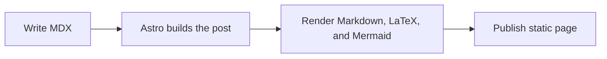

Welcome to my blog. I've finally integrated a **markdown-based** writing system into my portfolio.

## Testing Text Styles

This system supports all standard Markdown features:

- **Bold text** for emphasis.
- _Italic text_ for subtle notes.
- [External links](https://astraen.dev) for references.
- `Inline code` for technical snippets.

## Testing LaTeX

To ensure my math engine is working, here is a simple inline identity: $e^{i\pi} + 1 = 0$, and a block display equation:

$$
\int_{a}^{b} f(x) \,dx
$$

## Testing Mermaid

Here is a simple diagram for the blog publishing flow:

## Testing Media

I can also include images from my project structure easily:

_The first of many posts to come._
