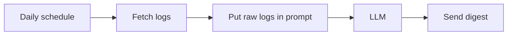
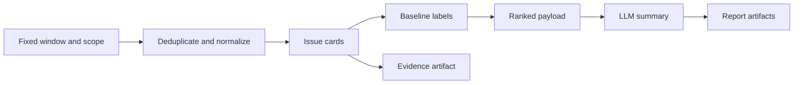
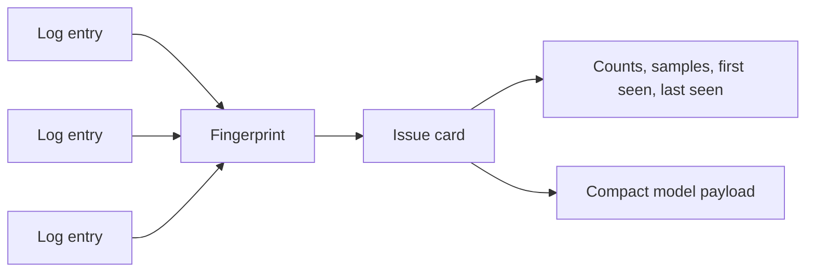
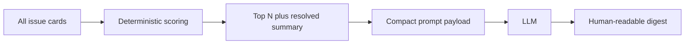

LLMs are useful at the end of an operations pipeline. They are risky at the beginning of one.

That distinction matters. Production logs are noisy, repetitive, inconsistent, and full of values that should not become reasoning anchors: request ids, timestamps, user ids, retry counters, object paths, stack trace line numbers, transient network strings, and one-off payload details. If you send that raw stream directly to a model and ask for "the important issues", you have delegated the hardest part of observability to the least deterministic component in the system.

The better pattern is boring first, probabilistic last.

Use deterministic code to decide the operational window, fetch the relevant logs, remove obvious noise, deduplicate repeated events, normalize volatile values, group related failures, compare them against history, and rank the evidence. Then ask the model to turn a compact set of issue cards into a readable report.

The model should summarize ranked evidence. It should not discover the evidence from raw log soup.

## The Tempting Version

The tempting version is short:



This can work in a demo. It tends to fail in production.

The problems show up quickly:

- Raw logs exceed context limits.
- High-volume repeats crowd out low-volume regressions.
- Slightly different messages look like separate incidents.
- Same incident in two services looks unrelated.
- Development or test noise leaks into production reports.
- Model output changes even when evidence did not.
- Nobody can audit why one issue was ranked above another.
- Reports are hard to compare day over day.

That is not an LLM problem. It is a pipeline design problem.

## The Useful Version

The useful version moves judgment about evidence into deterministic stages:



The model is still useful. It writes readable summaries, clusters symptoms into human language, and explains why ranked cards matter. But it works from a smaller, cleaner, auditable input.

That changes the failure mode. If the report is wrong, you can inspect the issue cards and decide whether the deterministic pipeline grouped, ranked, or labeled something incorrectly. You are no longer debugging an unbounded prompt full of raw production noise.

## Start With a Fixed Window

Operational digests need a stable concept of "day."

Calendar days are not always the right unit. Many businesses care about an operational day that starts after overnight jobs finish, after stores close, or before the morning support review. Pick the window deliberately and keep it fixed.

For example:

| Choice | Why it matters |
| --- | --- |
| `window_start` and `window_end` | Makes each run reproducible. |
| Business timezone | Prevents UTC boundaries from splitting local incidents oddly. |
| Small overlap | Catches delayed log ingestion without missing edge events. |
| Explicit filters | Keeps production, staging, development, sandbox, and test logs from mixing. |
| Stable run id | Lets artifacts, history, and reports tie back to one execution. |

The pipeline should be able to re-run the same window and produce the same compact evidence, modulo newly arrived logs inside the ingestion overlap. Without that property, comparisons become vague.

Scope should be just as explicit as time. Include only the environments, severities, services, and fields that belong in the report. The goal is not to hide problems. The goal is to avoid mixing different operational worlds in one digest. Scope belongs in artifact metadata so readers know what the report covered without reading pipeline code.

## Deduplicate Stable Events

Logs repeat. Retry loops repeat. Batch jobs repeat. Request failures repeat with different ids.

A useful digest should not treat every log line as a separate issue. It should create stable event fingerprints from fields that represent the failure, not the moment.

Think of fingerprint fields as identity signals versus noise:

| Good ingredients | Bad ingredients |
| --- | --- |
| Severity | Timestamp |
| Service or component | Request id |
| Error type | Trace id |
| Normalized message template | User id |
| Normalized stack frame signature | Random suffixes |
| Endpoint or job name | Object generation |
| Exit code or failure code | Retry attempt number |
| | Memory address |
| | Full URL with query params |

Deduplication does two things. It keeps the model payload small, and it preserves count as a signal. One unique error appearing 800 times is different from 800 unique errors appearing once.

## Normalize Volatile Values

Normalization is where a log digest becomes useful.

Raw messages are often almost the same:

```text
payment import failed for account 98122 request 7f9c...
payment import failed for account 77410 request a31b...
payment import failed for account 11803 request d91a...
```

Those are not three issues. They are one issue with volatile values.

The pipeline should replace volatile fragments with stable placeholders:

```text
payment import failed for account <id> request <id>
```

Normalize cautiously. Over-normalization merges unrelated failures. Under-normalization fragments one incident into dozens of cards.

Common normalization targets:

| Value type | Example placeholder |
| --- | --- |
| UUIDs and request ids | `<id>` |
| Long integers | `<number>` |
| ISO timestamps | `<timestamp>` |
| Object or file paths | `<path>` |
| Emails and user identifiers | `<user>` |
| Query strings | `<query>` |
| Repeated whitespace | single space |

This step is deterministic, testable, and worth owning in code. The model should not be responsible for deciding whether two noisy strings are the same incident.

## Group Logs Into Issue Cards

An issue card is the unit of reasoning.

It is not a log line, and it is not a final report section. It is compact evidence about one likely operational issue.



A good issue card carries enough data for a human or model to understand the problem without seeing every raw log:

| Field | Purpose |
| --- | --- |
| `issue_key` | Stable identity across runs. |
| `severity` | Prioritization input. |
| `component` | Area likely affected. |
| `normalized_message` | Human-readable failure template. |
| `count` | Volume during the window. |
| `first_seen` and `last_seen` | Timing within the run. |
| `sample_messages` | Representative raw evidence, capped. |
| `sample_context` | Small structured fields that explain impact. |
| `fingerprints` | Debug link back to grouping logic. |
| `source_links` | Optional links into log viewer or trace system. |

Cards make the model prompt small because each card is already a summary of many logs. They also make the pipeline auditable because every report claim can point back to a bounded evidence object.

## Compare Against Baseline History

Most production systems have recurring noise. If every digest says "database timeout occurred" with the same urgency every day, readers stop reading.

Baseline history lets the pipeline separate new issues from known ones before the model writes prose.

The baseline does not need to be complex:

| Baseline field | Use |
| --- | --- |
| `issue_key` | Match current card to previous cards. |
| `first_seen_date` | Identify genuinely new failures. |
| `last_seen_date` | Detect returning regressions. |
| `recent_run_count` | Distinguish chronic noise from new incidents. |
| `typical_count` | Compare current volume against normal volume. |
| `last_status` | Carry resolved, ignored, or watchlisted state. |

With that history, issue cards can be labeled before the model sees them:

- `new`: not seen in baseline.
- `regression`: seen before, absent recently, now back.
- `spike`: known issue with unusual volume.
- `known`: seen recently at similar volume.
- `resolved`: previously present, absent in current run.

This is one of the highest-leverage parts of the design. The model can describe a new regression well, but deterministic history should decide that it is new.

## Rank Before the Model Call

Ranking should happen before synthesis.

If you ask the model to rank raw logs, it may overweight dramatic wording and underweight structured evidence. Deterministic scoring gives you a predictable policy.

A simple score might combine:

- Severity.
- Count.
- Number of affected components.
- Newness.
- Regression status.
- Spike ratio versus baseline.
- Presence of user-facing endpoints or scheduled jobs.
- Whether the issue is already watchlisted or ignored.

The exact formula can be simple. The important part is that the formula is inspectable and versioned. If the report order is surprising, you can adjust scoring rules instead of prompt phrasing.

Then pass only the top ranked cards to the model, plus small summary metadata:



The model can still combine nearby cards in prose if they clearly relate. It should not be responsible for discovering which cards deserve attention.

## The Prompt Should Be Small and Boring

By the time the model runs, the prompt should not be a clever instruction maze. It should be a compact reporting task over structured evidence.

The prompt can ask for:

- A short executive summary.
- Top issues ordered by provided rank.
- Clear labels for new, regression, spike, and known issues.
- Evidence-based impact language.
- No invention beyond provided cards.
- A section for resolved or absent watchlist items.
- A machine-readable structured response if needed.

This is where the LLM helps. It turns structured cards into a readable operational narrative. It can reduce repetition, explain related failures together, and write the report in language a support or engineering lead can scan quickly.

But the model should not be asked to infer hidden facts. If impact is unknown, the evidence should say unknown. If ownership is unknown, the report should say unknown. Production summaries are not a place for confident guessing.

The report should still leave a trail. Keep the Markdown report, structured JSON, issue-card JSON, token estimate, and run metadata together. When someone asks, "Why did this appear in the digest?", the answer should be in the issue-card artifact, not hidden inside a model response.

Those artifacts also make iteration safer. You can replay the same compact payload with a changed prompt, or change grouping logic and diff issue cards before changing report style.

## The Principle

LLMs are good at language. They are not a substitute for observability design.

If you want a reliable production digest, make the deterministic pipeline answer these questions first:

- Which time window are we reviewing?
- Which logs are in scope?
- Which entries are duplicates?
- Which volatile values should not define identity?
- Which logs represent the same issue?
- Which issues are new, recurring, spiking, or resolved?
- Which evidence is strong enough to show a human?
- Which cards deserve model attention?

Then use the model for the part it is good at: turning ranked, bounded evidence into a clear report.

That division of labor is the whole pattern.

Deterministic code builds the case. The LLM writes the brief.
